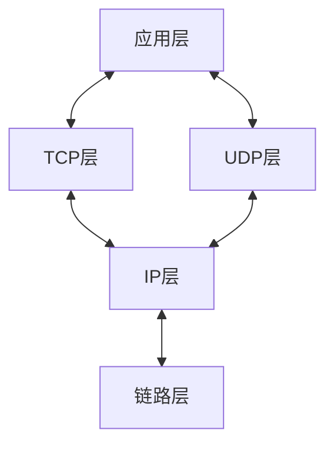
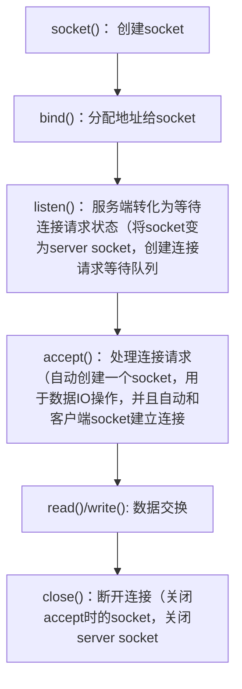
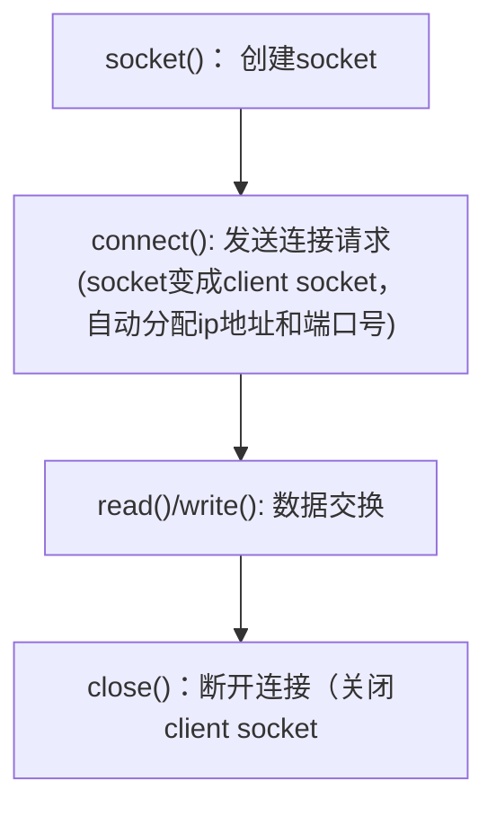
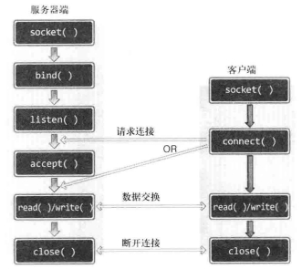
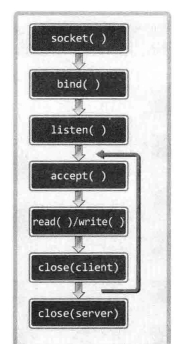
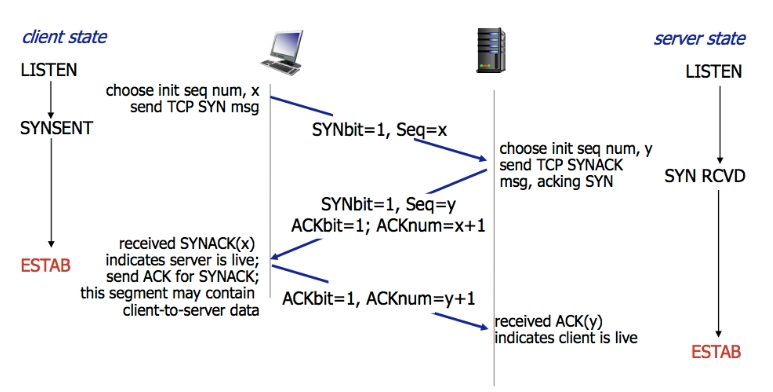
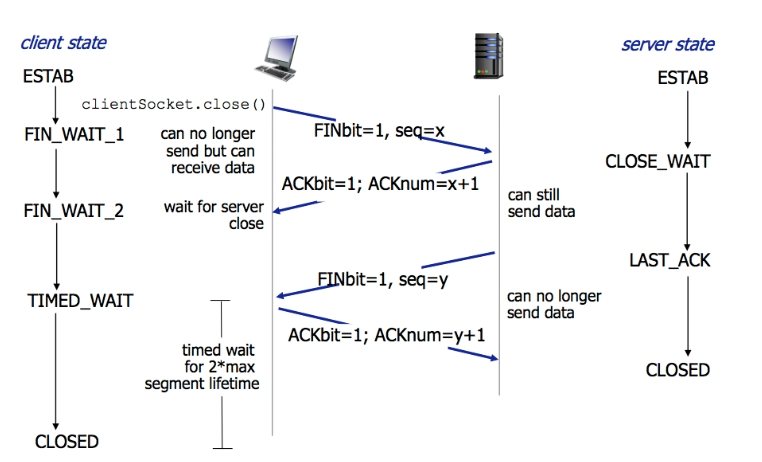
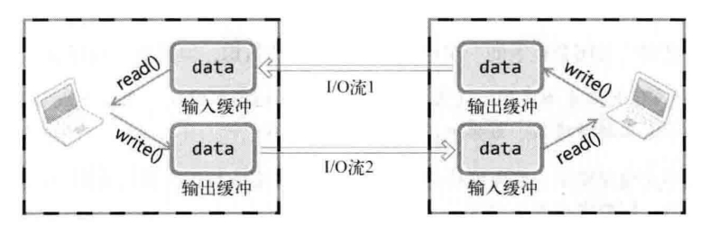

## Chapter1：理解网络编程和套接字

### 网络编程是什么，socket是什么
网络编程就是编写程序 使两台连网的计算机相互交换数据
所以需要物理连接 和 编写数据传输软件 
对于编写数据传输软件，操作系统会提供名为socket的部件，所以socket就是网络数据传输的软件设备


### TCP socket
> tcp socket可以类比成telephone 

#### 服务端socket
function: 处理连接请求
也可以称呼为 接电话socket，listening socket，主要步骤就是模拟接电话的行为

1. 调用socket函数创建socket (安装telephone)
2. 调用bind函数分配id地址和端口号（分配电话号码）
3. 调用listen函数将socket转化为可接受 连接请求 状态 （连接电话线）
4. 调用accept函数处理连接请求（接听电话）


#### 客户端socket
function：请求连接
也可以称呼为 打电话socket

1. 调用socket函数创建socket （安装电话）
2. 调用connect函数向服务端发送连接请求（拨打电话）

### Linux文件操作

#### 文件描述符
文件一般经过创建过程才会被分配文件描述符
0，1，2文件描述符默认分为输入输出对象stdin，stdout，stderr

为什么要用文件描述符？
首先文件信息非常多，为了方便称呼（标识）文件，操作系统会分配一个整数作为文件描述符

#### 文件操作
1. 打开文件
2. 关闭文件
3. 将数据写入文件
4. 读取文件中的数据


## Chapter2：套接字类型与协议设置

### 协议是什么
协议是对话中使用的通信规则，在计算机领域里，就是 计算机间对话的通信规则

### socket函数的参数
`int socket(int domain, int type, int protocol);`

1. domain: socket中使用的协议族信息
2. type：socket数据传输类型
3. protocol: 协议

### 协议族 protocol family
socket中的协议有一些大的分类（包括很多子协议），这些大的分类成为 协议族

### socket类型 type
socket类型指的是 socket的数据传输方式
> 为什么已经确定协议族了，还需要确定数据传输方式
> 因为一个协议族中可能存在多种数据传输方式

#### 面向连接的socket （SOCK_STREAM）
类似于传送带
1. 传输过程中数据不会丢失
2. 按序传输数据
3. 传输的数据不存在数据边界（boundary）


#### 面向消息的socket（SOCK_DGRAM）
类似于摩托车快递
1. 强调快速传输，不保证传输顺序
2. 传输的数据可能丢失也可能损坏
3. 传输的数据具有数据边界
4. 每次传输的数据大小有限制

### 协议参数
> 一般情况下，确定协议族和数据传输方式 即可确定协议，不需要第三个参数的话可以直接传0
> 有的时候仍然无法确定协议，所以需要第三个参数，协议protocol

IPv4协议族，SOCK_STREAM, 满足这两个条件的协议只有IPPROTO_TCP
`int tcp_socket - socket(PF_INET, SOCK_STREAM, IPPROTO_TCP)`

IPv4协议族，SOCK_DGRAM, 满足这两个条件的协议只有IPPROTO_UDP  
`int udp_socket - socket(PF_INET, SOCK_STREAM, IPPROTO_UDP)`


## Chapter3：地址族与数据序列

### IP地址
> 什么是ip，ip是internet protocol（网络协议）的简称

为使计算机（主机）连接到网络并收发数据，需要分配ip地址，ip地址分为两类IPv4和IPv6
IPv4：internet protocol version 4 |   4字节地址族
IPv6：internet protocol version 6 |   16字节地址族

详细探讨IPv4
ipv4有两部分，网络地址和主机地址，分为A,B,C,D,E等类型
A: 网络id 1字节 | 主机id 3字节
B：网络id 2字节 | 主机id 2字节
C: 网络id 3字节 | 主机id 1字节
D：多播ip地址

### 网络地址与主机地址

网络地址（网络id）区分网络，主机地址（主机id）区分内网里的主机
数据传输的时候，首先传到网络，网络（构成网络的路由器router或者交换机switch）接收到数据后，浏览主机地址后将数据传给目标主机、

> 构建网络需要一种物理设备 完成 外网与内网主机之间的数据交换，这种设备就是路由器或交换机
> 它们也是计算机，日常使用的计算机安装适当的软件，也可以用作交换机，交换机比路由器要简单一些

### 端口号
ip用于区分网络里的主机，但是主机可能接收多种数据，需要多个socket，用端口号区分
通过NIC（network interface card 网卡）接收的数据含有端口号，操作系统根据端口号，把数据传给相应端口的socket
数据传输接收地址，需要包含ip地址和端口号，这样数据才会被传输到对应的应用程序

### 地址信息

#### sockaddr 结构体 和 sockaddr_in 结构体

这两个结构体的作用都是**保存地址信息**
```
// 所有协议 地址信息
struct sockaddr {
    sa_family_t sin_family;   //地址族
    char sa_data[14];         //地址 ip + port
}

// 针对 IPv4协议 地址信息
struct sockaddr_in {
    sa_family_t     sin_family;   //地址族
    unit16_t        sin_port;     //16位TCP/UDP 端口号
    struct in_addr  sin_addr;     //32位IP地址
    char            sin_zero[8];  //对齐sockaddr
}

struct in_addr {
    In_addr_t s_addr;             //32位ipv4地址
}
```

#### bind函数
`int bind(int sockfd, struct sockaddr *myaddr, socklen_t addrlen);`
向socket分配ip地址
成功返回0，失败时返回-1

第二个参数需要sockaddr结构体的地址，里面包含了地址族，地址，端口号信息

Question 1：为什么不直接在sockaddr填充信息，而是在sockaddr_in填充信息然后传给sockaddr
ans: 因为sa_data没有填充的位需要置0，操作比较麻烦

Question 2: sockaddr_in保存的是ipv4协议地址信息，为什么还需要有成员变量sin_family
ans: sockaddr_in需要直接转化位sockaddr，内存需要对齐，所以需要有sin_family信息

### 网络字节序

CPU向内存存储数据的方式有两种
大端序（big endian）：高位字节存放到低位地址（起始端是最高字节，从左边开始）
小端序（little endian）：高位字节存放到高位地址（起始端是最小字节，从右边开始）

0x12345678,0x12是高位字节，0x78是最地位字节
地址：0x20    0x21    0x22    0x23  低地址->高地址
数据：0x12    0x34    0x56    0x78  // 大端序
数据：0x78    0x56    0x34    0x12  // 小端序

网络字节序是大端序
intel和amd cpu都采用小端序

Q: 如何判断该主机是小端序还是大端序
A: htons,htonl函数，转化字节序为网络字节序（大端序）,如果转化前后相等，说明是大端序，否则是小端序. 

Q:为什么转化为网络字节序后，小端序cpu访问数据不同？
A: 核心点：存储数据（写），访问数据（读）；
大端序 写从内存左边开始，读同样也是从左边开始；
小端序 写从内存右边开始，读同样也是从右边开始；

所以如果没有转化为网络字节序，写的时候原端序，读的时候原端序，写和读时数据一致；转化为网络字节序后，存储（写）的时候变成大端序
对于大端序来说，写读仍然都是大端序，写和读时数据一致
对于小端序来说，写是大端序，读是小端序，写和读时数据不一致


### 字节序转化 （endian conversations）
```
unsigned short htons(unsigned short);
unsigned short ntohs(unsigned short);
unsigned long htonl(unsigned long);
unsigned long ntohl(unsigned long);

h 代表主机（host）字节序, n 代表网络（network）字节序
s 代表 short(2 bytes), l 代表 long(4 bytes)
unsigned long = unsigned 32-bit int
```


### 字符串转化为网络字节序的整数型
```
字符串形式的ipv4地址 <==> 32位整数型数据

// ipv4 string -> 32-bit int
in_addr_t inet_addr(const char *string);

// 32-bit int -> ipv4 string
char *inet_ntoa(struct in_addr adr);  
//多次调用会覆盖之前的，所以调用后立马strcpy到其他变量

// 转化为32位整数型后，然后存入in_addr里
int inet_aton(const char *string, struct in_addr *addr);
```

### ip地址初始化

标准写法
```
struct sockaddr_in addr;
char *serv_ip = "211.217.168.13";           //声明IP地址字符串
char *serv_port = "9190";                   //声明端口号字符串
memset(&addr, 0, sizeof(addr));             //结构体变量 addr 的所有成员初始化为0
addr.sin_family = AF_INET;                  //指定地址族
addr.sin_addr.s_addr = inet_addr(serv_ip);  //基于字符串的IP地址初始化
addr.sin_port = htons(atoi(serv_port));    //基于字符串的IP地址端口号初始化
```

INADDR_ANY
可以避免初始化ip地址，直接得到ip地址，但是注意一个主机可以有多个ip地址，取决于网卡（NIC）数


## Chapter4/5：基于TCP的服务器端/客户端

> 根据数据传输方式不同，基于网络协议的socket分为TCP socket （transmission control）和 UDP socket

### TCP/IP协议栈
网络数据传输 不是通过一个大的协议解决 而是通过层次化方案TCP/IP协议栈解决 
> 为什么使用分层协议栈？
> 1. 协议设计更容易，不同层解决不同的问题
> 2. 利于标准化，成为open system，这样可以让所有的产商都按照相同的标准设计，制造



各层可能通过操作系统等软件实现，也可能通过类似NIC的硬件设备实现

链路层：解决物理链接的问题，同时也是物理链接领域标准化的结果，物理链接需要有主机，路由器或者交换机，还有通信链路，其中有LAN,WAN,MAN标准 （物理链接，准备传输）
IP层：解决传输数据时的路径选择问题 （路径选择，可以传输）
传输层：以IP层提供的路径信息为基础，解决实际的数据传输问题 （决定传输方式，怎么传输）
应用层：编写软件，决定服务端和客户端之间的传输规则

### 实现基于TCP的服务端/客户端

#### TCP服务端流程


实现代码，[hello_server.c](./chapter5/hello_server.c)


#### TCP客户端流程

实现代码: [hello_client.c](./chapter5/hello_client.c)


#### 服务端/客户端调用关系图


#### 迭代服务器端/客户端
客户端发送连接请求前，服务器端有可能已经调用accept(),此时调用accept()会进入阻塞状态，直到客户端嗲用connect()为止

上述服务器端处理完一个客户端连接请求就退出了，为了处理连接请求队列里的所有请求，我们需要反复调用accept()函数

首先close accept()时创建的socket
然后重新调用accept()函数，处理新的连接请求


实现代码：
[echo_server.c](./chapter5/echo_server.c)
[echo_client.c](./chapter5/echo_client.c)


#### 回声服务器端/客户端的问题
问题不在服务器端，而是在客户端
1. 原因
因为服务器端，read多少字节，write多少字节；而客户端，write多少字节，read的时候不能保证同样的字节数
2. 客户端里，提前确定read数据的大小

修改后的程序：[echo_client2.c](./chapter5/echo_client2.c)


### 计算器服务器端/客户端实现
> motivation: 如果没办法预知接收数据长度，那么就要定义应用层协议
> 要求：服务器端从客户端获得多个数字和运算符信息，进行加减乘运算，然后把结果传给客户端 eg: 发送请求 3，5，9，+，回应3 + 5 + 9

参考实现 [op_server.c](./chapter5/op_server.c), [op_client.c](./chapter5/op_client.c)

尽量自己独立实现一遍，更好的掌握TCP的服务器端/客户端的实现方法


### TCP socket下的I/O缓冲
write函数调用后并非立即传输数据，而是先将数据移至输出缓冲；read函数调用后也并非立即接收数据，而是从输入缓冲读取数据

I/O缓冲特性
1. 在每个socket中单独存在
2. 创建socket的时候自动生成
3. 关闭socket，继续发送输出缓冲中的数据
4. 关闭socket，丢失输入缓冲中的数据

那么存不存在传输数据 > 输入缓冲的情况呢
ans: TCP中不存在，因为TCP会控制数据流，不会发生超过输入缓冲大小的数据传输

### TCP工作原理
TCP socket从创建到消失经历三步
1. 与对方套接字建立连接
2. 与对方套接字进行数据交换
3. 断开与对方套接字的连接

#### 与对方套接字的连接
TCP socket建立连接，需要三次对话过程，该过程又称为**三次握手**
> seq 序号 ack 确认号
> SYNbit = 1，SYN标志位置1，同步消息
> ACKbit = 1，ACK标志位置1，确认消息


1. 客户端发送同步消息（SYNbit = 1, seq = x）SYN
2. 服务器端发送确认消息 (ACKbit = 1, ack = x + 1) 和 同步消息(SYNbit = 1, seq = y) SYN + ACK
3. 客户端发送确认消息（ACKbit = 1, ack = y + 1）ACK

#### 与对方套接字的数据交换
ack = seq + bytes + 1
TCP采用超时重传机制

#### 断开与对方套接字的连接
双方各发送一次FIN消息然后断开连接，需要四次对话过程，因此又称四次挥手



## Chapter 7: 优雅地断开套接字连接

### 基于TCP的半关闭

close函数是完全断开连接，无法传输数据，也无法接收数据
half close，只关闭一部分数据交换中使用的流，只能传输或接收，也就是只关闭流的一半

两台主机通过套接字建立连接 进入 可交换数据 的状态 （流形成的状态）



shutdown 用来关闭其中一个流
```
int shutdown(int sock, int howto);
/*
成功时返回 0 ，失败时返回 -1
sock: 需要断开套接字文件描述符
howto: 传递断开方式信息

SHUT_RD : 断开输入流
SHUT_WR : 断开输出流
SHUT_RDWR : 同时断开 I/O 流
*/
```

**为什么需要半关闭**
假设如下场景，服务器端给客户端传输文件，然后客户端收到后发送thank you给服务端
如果调用close，那么同时关闭io流，这样服务器端发送EOF后，此时就无法接收thank you消息了，但是如果调用shutdown，只关闭服务器端的输出流，这样服务器端既可以发送EOF，又可以接收thank you消息

### 基于半关闭的文件传输程序

参考实现代码:
[file_server.c](./chapter7/file_server.c)
[file_client.c](./chapter7/file_client.c)